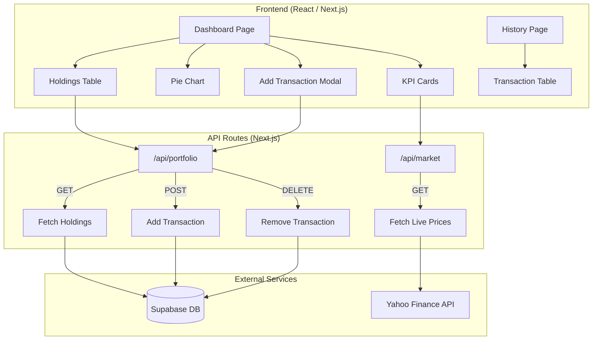

# 📊 Portfolio Analytics — Personal Finance Tracker

A premium, real-time portfolio analytics dashboard for tracking investments across **Indian (NSE/BSE)** and **Global** stock markets. Built with Next.js 16, Supabase, and Yahoo Finance.

---

## ✨ Features

| Feature | Description |
|---|---|
| **Live Price Tracking** | Real-time quotes via Yahoo Finance, auto-refreshed every 60s |
| **Portfolio Dashboard** | KPI cards for Total Value, Invested Amount, Day's P&L, Overall P&L |
| **Asset Allocation** | Interactive donut chart showing portfolio breakdown |
| **Transaction Management** | Add buy/sell transactions, delete holdings |
| **Transaction History** | Full filterable history page with buy/sell breakdown |
| **Market Status** | Live NSE market open/closed indicator with auto-detection |
| **Multi-Market Support** | Indian stocks (`.NS`, `.BO`), US stocks, ETFs, and more |
| **Premium UI** | Dark glassmorphism design with animations and micro-interactions |

---

## 🏗️ Architecture



---

## 🛠️ Tech Stack

| Layer | Technology |
|---|---|
| **Framework** | Next.js 16 (App Router) |
| **Language** | TypeScript |
| **Styling** | Tailwind CSS 4 |
| **Database** | Supabase (PostgreSQL) |
| **Market Data** | yahoo-finance2 v3 |
| **Charts** | Recharts |
| **Icons** | Lucide React |
| **Analytics** | Vercel Speed Insights |

---

## 🚀 Getting Started

### Prerequisites

- **Node.js** 18+ and **pnpm** (or npm/yarn)
- A free [Supabase](https://supabase.com) account

### 1. Clone & Install

```bash
git clone https://github.com/your-username/portfolio-tracker.git
cd portfolio-tracker
pnpm install
```

### 2. Set Up Supabase

1. Create a new project at [supabase.com](https://supabase.com)
2. Go to **SQL Editor** and run the contents of [`supabase.sql`](supabase.sql):

```sql
-- Creates the portfolio_holdings table with RLS policies
create table public.portfolio_holdings (
  id uuid default gen_random_uuid() primary key,
  ticker text not null,
  quantity numeric not null,
  average_price numeric not null,
  is_buy boolean default true,
  created_at timestamp with time zone default timezone('utc'::text, now()) not null
);

alter table public.portfolio_holdings enable row level security;
create policy "Allow anonymous read" on public.portfolio_holdings for select using (true);
create policy "Allow anonymous insert" on public.portfolio_holdings for insert with check (true);
create policy "Allow anonymous update" on public.portfolio_holdings for update using (true);
create policy "Allow anonymous delete" on public.portfolio_holdings for delete using (true);
```

3. Copy your project URL and anon key from **Settings → API**.

### 3. Configure Environment Variables

Create a `.env.local` file in the project root:

```env
NEXT_PUBLIC_SUPABASE_URL=https://your-project-id.supabase.co
NEXT_PUBLIC_SUPABASE_ANON_KEY=your-anon-key-here
```

### 4. Run the Development Server

```bash
pnpm dev
```

Open [http://localhost:3000](http://localhost:3000) to see the app.

---

## 📁 Project Structure

```
portfolio-tracker/
├── src/
│   ├── app/
│   │   ├── api/
│   │   │   ├── market/route.ts     # Yahoo Finance live quotes
│   │   │   └── portfolio/route.ts  # CRUD for portfolio holdings
│   │   ├── history/page.tsx        # Transaction history page
│   │   ├── page.tsx                # Main dashboard page
│   │   ├── layout.tsx              # Root layout with Inter font
│   │   └── globals.css             # Design tokens & glass effect
│   ├── components/
│   │   ├── Dashboard.tsx           # Main dashboard with KPIs, chart, live status
│   │   ├── HoldingsTable.tsx       # Holdings table with delete capability
│   │   └── AddTransactionModal.tsx # Buy/sell transaction form
│   └── lib/
│       ├── supabase.ts             # Supabase client
│       └── utils.ts                # Utility helpers (cn)
├── supabase.sql                    # Database schema
├── .env.local                      # Environment variables (not committed)
└── package.json
```

---

## 📡 API Reference

### `GET /api/portfolio`
Returns all portfolio transactions, ordered by `created_at` descending.

### `POST /api/portfolio`
Adds a new transaction.
```json
{
  "ticker": "RELIANCE.NS",
  "quantity": 10,
  "average_price": 2450.50,
  "is_buy": true
}
```

### `DELETE /api/portfolio`
Deletes a transaction by ID.
```json
{ "id": "uuid-of-transaction" }
```

### `GET /api/market?tickers=RELIANCE.NS,AAPL`
Returns live market data for the specified comma-separated tickers.

---

## 🏷️ Ticker Symbol Guide

| Market | Format | Example |
|---|---|---|
| NSE (India) | `SYMBOL.NS` | `RELIANCE.NS`, `TCS.NS`, `INFY.NS` |
| BSE (India) | `SYMBOL.BO` | `RELIANCE.BO` |
| US Stocks | `SYMBOL` | `AAPL`, `GOOGL`, `MSFT` |
| Indian ETFs | `SYMBOL.NS` | `GOLDBEES.NS`, `NIFTYBEES.NS` |
| Crypto | `SYMBOL-USD` | `BTC-USD`, `ETH-USD` |

> **Note:** Gold ETFs use `.NS` suffix (e.g. `GOLDBEES.NS`), not `.NSC`.

---

## 🚢 Deployment

### Deploy to Vercel (Recommended)

1. Push your code to GitHub
2. Import the repository on [vercel.com](https://vercel.com)
3. Add your environment variables in Vercel's dashboard
4. Deploy!

The app includes `@vercel/speed-insights` for automatic performance monitoring.

---

## 🐛 Troubleshooting

| Issue | Solution |
|---|---|
| `Call const yahooFinance = new YahooFinance() first` | Ensure you're using v3 syntax: `const yf = new YahooFinance()` |
| Ticker not found | Verify the ticker symbol format (see Ticker Guide above) |
| Supabase connection error | Check your `.env.local` URL and anon key |
| Prices show 0 | Market may be closed; API returns last available price |
| CORS errors | API routes run server-side; ensure fetch URLs are relative (`/api/...`) |

---

## 📜 License

This project is for personal use. Feel free to fork and customize.
